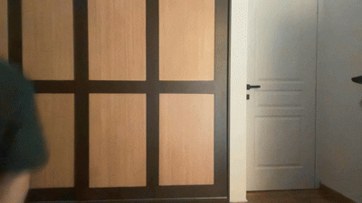

# Human Activity Monitor 🕵️‍♂️🤖

A smart surveillance system that combines real-time computer vision with advanced Large Language Models (LLMs) to detect human presence and understand their actions.


*Demo Description: The system detects a person entering the frame, records the encounter, and uses Gemini to identify actions such as walking or standing.*

## 🌟 Overview
This project uses **YOLOv8** for high-speed local object detection to identify when a person enters the camera's field of view. When a person is detected, the system records a video clip. Once the person leaves, the clip is automatically sent to **Google Gemini (GenAI)** to analyze the specific actions (e.g., walking, falling, or suspicious behavior) and generates a written report.

## ✨ Features
- **Real-time Human Detection**: Low-latency detection using YOLOv8.
- **Automated Recording**: Captures video only when a person is present, including a configurable cooldown period.
- **AI Action Analysis**: Leverages Gemini 1.5 Flash to provide human-like descriptions of captured activities.
- **Asynchronous Processing**: Analysis happens in the background, ensuring the camera feed remains smooth and uninterrupted.
- **Local Reports**: Automatically saves `.txt` analysis reports in a dedicated `actions/` directory.

## 🛠️ Installation

1. **Clone the repository:**
   ```bash
   git clone <your-repo-url>
   cd human_activity_monitor
   ```

2. **Install dependencies:**
   ```bash
   pip install opencv-python ultralytics google-genai python-dotenv
   ```

3. **Setup Environment Variables:**
   Create a `.env` file in the root directory:
   ```env
   GEMINI_API_KEY=your_google_gemini_api_key_here
   ```

## 🚀 Usage
Run the main script to start the monitor:
```bash
python main.py
```
- The "Feed" window will display the live camera.
- Detected persons will be highlighted with a bounding box.
- Press **'q'** to stop the system and close all windows.

## 📂 Project Structure
- `main.py`: The entry point that initializes and runs the detector loop.
- `utils.py`: Contains the `HumanDetector` (OpenCV/YOLO logic) and `ActionAnalyzer` (Gemini API logic) classes.
- `config.py`: Centralized configuration for model variants, thresholds, and API settings.
- `recordings/`: Directory where video clips and AI reports are stored.
  - `actions/`: Subdirectory specifically for generated AI text reports.
  
## ⚙️ Configuration
You can adjust settings in `config.py`:
- `CONFIDENCE_THRESHOLD`: Minimum confidence for YOLO to trigger a recording.
- `COOLDOWN_SECONDS`: How long to keep recording after the person leaves the frame.
- `MODEL_VARIANT`: Choose between YOLOv8 nano, small, medium, etc.

---